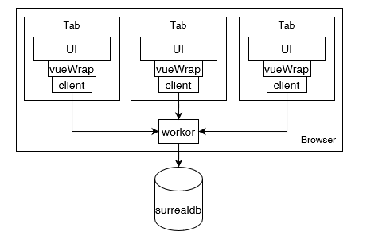

# SurrealDB in worker!
<!-- ALL-CONTRIBUTORS-BADGE:START - Do not remove or modify this section -->
[](#contributors-)
<!-- ALL-CONTRIBUTORS-BADGE:END -->

## WHY?

The main thread is full of stuff that don't need to be there. Also when you have
an Application where each client connects via WebSocket to SurrealDB that will
be a lot of open connections.

This package enables you to use 1 Connection per browser (NOT per tab). All
Connection related stuff (basicly most querys) has to be moved into a single
config object that lives in the Worker.

> NOTE: If the browser of the user supports SharedWorker it is a good idea to
> use it!


## Live Querys

This is build with live querys in mind so as soon as they are available they are
added here.

## Browser support

This needs the Lock API! See https://caniuse.com/mdn-api_lock for support.

## Size

Uncompressed (but minified) you add arround 5KB to your page. With gzip or
brotli you get that to 1-2KB!

## In worker

```ts
import { setupWorker } from "surrealdb.worker/dist/worker.js";

export const config = {
  query: {
    name: (con: Surreal) => {
      // We get the db connection instance and have 
      // to return a promise of X or X where X is 
      // a JSON-stringifyable object
    }
  },
  live: {
    name: (con: Surreal) => {
      // We get the db connection instance and have 
      // to return a promise of X or X where X is 
      // a Live instance (from surrealdb.js)
    }
  }
};

setupWorker(config).then((init) => {
  // When this runs the Worker only exists once!
  // This only runs again (in a different worker) if
  // The worker is killed (because tab closed + SharedWorker not supported)
  init('http://localhost:8000/rpc'); 
});
```

## In client to start worker

```ts
import { startWorker } from "surrealdb.worker/dist/worker.setup.js";

startWorker(new URL("./path/to/worker/file", import.meta.url));
```

## in client to setup cliet

```ts
import { config } from "./path/to/worker/file";
import { setupClient } from "surrealdb.worker/dist/client.js";

const client = setupClient<typeof config>();

// For vue
import { vue } from "surrealdb.worker/dist/framework/vue.js";
const vueClient = vue<typeof config>(client);
```

To call a function from the client just run

```ts
client.query.name(/* my args */)
client.live.name(/* my args */)
```

Same is true for the vue and the react client wrapper they just return something different.

### Performance
You should only create 1 client per tab! And each tab should call `startWorker`.
## Frameworks

As I will use this with Vue I added a wrapper for that. I also added a react
wrapper but I don't know if that works / what the best practices for that are.

You want to add other frameworks? Feel free to create a PR for this!

## Multiple Worker
If you have multiple surrealdb instances you want to connect to or have different workers you can add a name argument to the `setupWorker`, `startWorker` and `setupClient` calls.

## Vite support
You can import a small vite plugin:

```ts
import surrealdbWorker from "surrealdb.worker/vite/plugin.js"

export default {
  /*... */
  plugins: [
    /*... */
    surrealdbWorker()
    /*... */
  ],
  /*... */
}
```

This allowes imports like this:

```ts
import setup from 'sdb.w:default:./path/to/worker/file'


const promiseThatNeverResolves = setup()
```

## Why imports like `surrealdb.worker/dist/...`
This makes it a lot more easy to have multiple entrypoints for this package!

## Contributors ✨

Thanks goes to these wonderful people ([emoji key](https://allcontributors.org/docs/en/emoji-key)):

<!-- ALL-CONTRIBUTORS-LIST:START - Do not remove or modify this section -->
<!-- prettier-ignore-start -->
<!-- markdownlint-disable -->
<table>
  <tbody>
    <tr>
      <td align="center"><a href="http://ec-nordbund.de"><br /><sub><b>Sebastian Krüger</b></sub></a><br /><a href="https://github.com/surrealdb-community/surrealdb.worker/commits?author=mathe42" title="Code">💻</a> <a href="#maintenance-mathe42" title="Maintenance">🚧</a></td>
    </tr>
  </tbody>
  <tfoot>
    
  </tfoot>
</table>

<!-- markdownlint-restore -->
<!-- prettier-ignore-end -->

<!-- ALL-CONTRIBUTORS-LIST:END -->

This project follows the [all-contributors](https://github.com/all-contributors/all-contributors) specification. Contributions of any kind welcome!